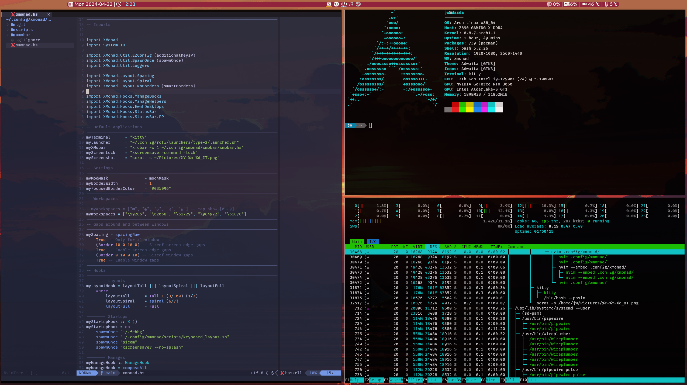

# My XMonad configuration

This is my XMonad config using XMobar for Arch Linux.

## Information

- Terminal: Kitty
- Editor: NeoVim
- Launcher: Rofi
- ScreenLock: Xscreensaver
- Background: Feh (with timer to automatically change wallpaper every 5 minutes)
- Compositor: Picom

## Screenshot

